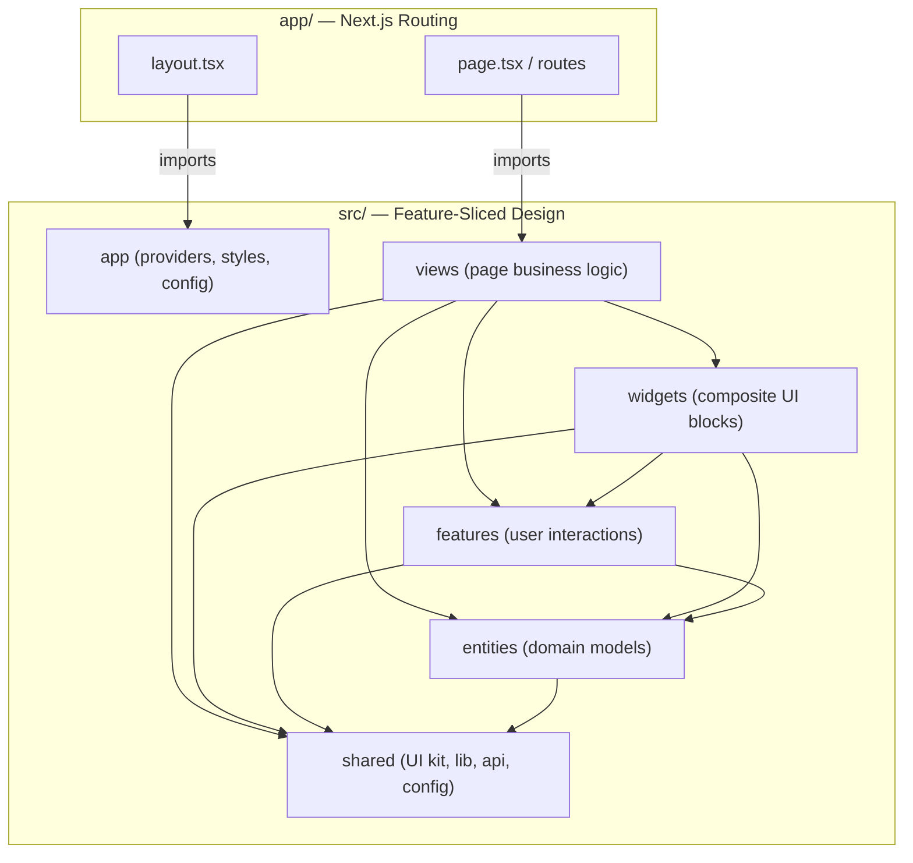

# AI Advent

AI-powered application built with Next.js 16 and the Anthropic SDK.

## Tech Stack

- **[Next.js 16](https://nextjs.org/)** — App Router, React Compiler, Cache Components
- **[React 19](https://react.dev/)** — Server Components, Actions
- **[TypeScript 5](https://www.typescriptlang.org/)** — Strict mode
- **[Tailwind CSS 4](https://tailwindcss.com/)** — Utility-first styling
- **[shadcn/ui](https://ui.shadcn.com/)** + **[Radix UI](https://www.radix-ui.com/)** — Accessible component primitives
- **[Anthropic SDK](https://docs.anthropic.com/en/docs/sdks)** — AI integration
- **[Vitest](https://vitest.dev/)** + **[React Testing Library](https://testing-library.com/react)** — Unit & component testing
- **[Biome](https://biomejs.dev/)** — Linting, formatting, import sorting

## Architecture

The project follows **[Feature-Sliced Design (FSD)](https://feature-sliced.design/)** — an architectural methodology that organizes code into standardized, hierarchical layers with strict import rules.

The `views` layer is used instead of the standard FSD `pages` layer to avoid confusion with the Next.js App Router `/app` directory. The `/app` directory handles routing only (minimal logic), while `/src/views` contains page business logic.

### Layer Hierarchy

Each layer can only import from layers **strictly below** it:

```
┌─────────────────┐
│      app        │  ← Global providers, styles, config
├─────────────────┤
│     views       │  ← Page-level business logic
├─────────────────┤
│    widgets      │  ← Large composite UI blocks
├─────────────────┤
│    features     │  ← User-facing interactions
├─────────────────┤
│    entities     │  ← Business domain models
├─────────────────┤
│     shared      │  ← UI kit, utilities, API client
└─────────────────┘
```

### Architectural Flow



## Project Structure

```
app/                              # Next.js App Router (routing only)
  layout.tsx                      # Root layout — imports providers, styles
  page.tsx                        # Home route — renders HomeView

src/
  app/                            # FSD: app layer
    providers/                    # Global context providers
    styles/
      globals.css                 # Tailwind + shadcn CSS variables
    config/
      fonts.ts                    # Geist font configuration

  views/                          # FSD: views layer
    home/
      ui/HomeView.tsx
      index.ts

  widgets/                        # FSD: widgets layer
  features/                       # FSD: features layer
  entities/                       # FSD: entities layer

  shared/                         # FSD: shared layer
    ui/                           # shadcn/ui components
    lib/
      utils.ts                    # cn() — class merging utility
    api/                          # API client
    config/                       # Environment, constants

  test/                           # Test infrastructure
    setup.ts                      # Vitest + jest-dom setup
    smoke.test.tsx
```

## Getting Started

```bash
# Install dependencies
npm install

# Start development server
npm run dev

# Build for production
npm run build

# Start production server
npm start
```

Open [http://localhost:3000](http://localhost:3000) in your browser.

## Scripts

| Script              | Description                              |
| ------------------- | ---------------------------------------- |
| `npm run dev`       | Start development server                 |
| `npm run build`     | Production build                         |
| `npm start`         | Start production server                  |
| `npm run lint`      | Lint, format, and sort imports (auto-fix)|
| `npm run format`    | Format all files                         |
| `npm run check`     | Check for lint/format issues (no writes) |
| `npm test`          | Run tests in watch mode (Vitest)         |
| `npm run test:run`  | Run tests once                           |
